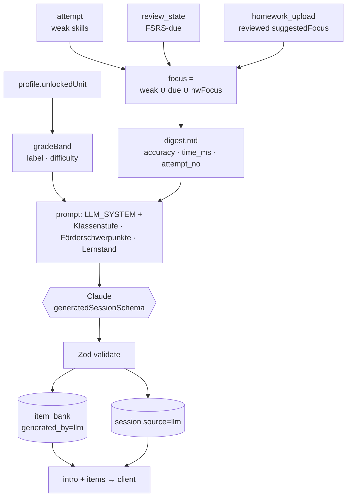
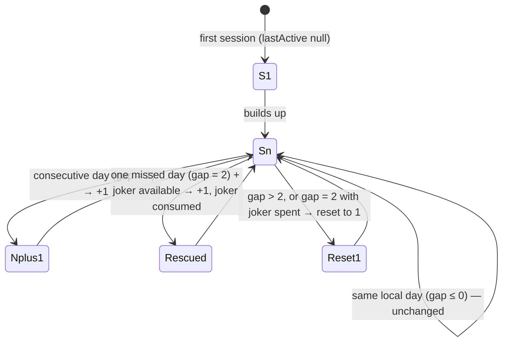

# SPEC — besserlesenschreiben **Backend**

Adaptive German children's literacy tutor. This is the **backend** project (separate repo/folder).
The frontend is a separate Vite/React SPA that talks to this service only over the HTTP API defined here.
**The API contract in §6 is the boundary — the frontend depends on it. Treat it as the source of truth.**

> **Governed by `../ARCHITECTURE.md`** (versions, API rules, errors, logging, hosting, payments, media). Read `./AGENTS.md` first, then `../ARCHITECTURE.md`, then this file. On any conflict, ARCHITECTURE wins.

---

## 1. Stack & principles

- **Language/framework:** Node.js 24 LTS + TypeScript + **NestJS 11** (Fastify adapter). **Zod** schemas
  (via `nestjs-zod`) for all request/response DTOs; `@nestjs/swagger` emits the OpenAPI the frontend types from.
- **DB:** PostgreSQL 17 via **Prisma 7** (`prisma/schema.prisma` is the model truth). Migrations with **Prisma Migrate**.
- **Object storage:** **Amazon S3** (per-user prefixes, short-lived **presigned** URLs) via `@aws-sdk/client-s3`.
- **Auth:** passwordless email code → JWT session token. Separate **parent PIN** elevation.
- **LLM:** `@anthropic-ai/sdk` (session generation, chat, homework vision); structured JSON via `zodOutputFormat` +
  `messages.parse` reuses the same Zod schemas. Model string configurable via env. See `../ARCHITECTURE.md` §8 for
  the LLM data-flow decision (Anthropic-direct, `inference_geo: "eu"`).
- **TTS:** **Amazon Polly** neural voices (`de-DE`), pre-generated per item and cached in S3 — deferred (Web-Speech fallback in the client).
- **Payments:** none — the app is **free** (billing deferred; ARCHITECTURE §9).
- **Hosting:** small **AWS EC2** instance, region Frankfurt eu-central-1 (see `../ARCHITECTURE.md` §7; deployment is a future milestone). **Never rely on local disk for persistence.**

**Hard rules (security boundary):**
1. `user_id` / `profile_id` is **always derived from the JWT**, never from a client-supplied path or body field.
2. All object-storage access is via **presigned URLs scoped to a single object under the authenticated user's prefix**. Bucket credentials/paths are never exposed.
3. Parent-scoped and billing endpoints require a valid **parent elevation claim** (§4).
4. AI endpoints (`★`) are **free** — no entitlement/credit/`402` check (billing deferred, ARCHITECTURE §9); access is gated by `account.status='active'` instead (§4).

---

## 2. Domain model

**Account = one parent email. Profiles = one or more children under it.** The child uses the device;
the parent email authenticates the household; the PIN re-gates parent controls and billing.

```
account (1) ───< profile (N children)
profile (1) ───< session ───< attempt
profile (1) ───< homework_upload ───< homework_review
profile (1) ───< chat_message
profile (1) ───< review_state
item_bank (global, shared) ──referenced by── attempt.item_id
# The `lexeme` word foundation (and the exercise-generation pipeline it grounded) was dropped 2026-07-13
# along with the Vokaltraining content set — see ROADMAP.md §F for the content-set redesign in progress.

# STAFF realm (disjoint identity — ARCHITECTURE §1a):
reviewer (internal staff) ───< homework_review        # authoritative homework verdicts
reviewer ──claims/actions──▶ homework_upload          # shared queue, soft-locked while claimed
```

---

## 3. Database schema (canonical system of record)

Expressed as Postgres DDL below; the **source of truth in code is `prisma/schema.prisma`**, from which Prisma
generates the client and migrations. `item_bank.seed_key` is the unique natural key for idempotent seeding.

```sql
-- ACCOUNT (household, keyed by parent email)
account(
  id               uuid pk,
  email            text unique not null,
  status           text default 'pending',  -- 'pending' | 'active' | 'deactivated' (lifecycle, ARCHITECTURE §1b)
  parent_pin_hash  text,                 -- argon2; null until set at onboarding
  pin_attempts     int default 0,        -- durable PIN lockout (§4)
  pin_locked_until timestamptz,
  created_at       timestamptz default now()
)
-- Access = approval, not payment (ARCHITECTURE §1b/§9): a first login-code request creates a `pending`
-- account and emails NOTHING; a staff admin approves it → `active` → the code is released. `deactivated`
-- blocks login. The family JwtAuthGuard requires status='active' on every request (immediate revocation).

-- LOGIN CODES (passwordless)
login_code(
  id          uuid pk,
  account_id  uuid fk -> account,       -- null-able: created on first request by email
  email       text not null,
  code_hash   text not null,            -- hash the 4-digit code too
  expires_at  timestamptz not null,     -- ~10 min
  consumed_at timestamptz,
  attempts    int default 0             -- rate-limit verify
)

-- PROFILE (a child)
profile(
  id            uuid pk,
  account_id    uuid fk -> account,
  name          text not null,
  buddy         text default 'nepo',    -- selectable buddy: nepo | stella (more mascot art in frontend/monster-pets, reserved for later)
  goal_per_week int  default 5,
  -- accessibility / settings (mirrors prototype state)
  sound_on      bool default true,
  dyslexic_font bool default false,
  font_scale    numeric default 1.0,
  -- gamification & progression state
  stars         int default 0,
  streak_days   int default 0,
  last_active   date,
  unlocked_unit int default 1,          -- highest unit unlocked; /parent/unlock-next increments it; drives /units status
  created_at    timestamptz default now()
)

-- ITEM BANK (global, was hardcoded LESSONS[] in the prototype; now server-owned)
item_bank(
  id            uuid pk,
  seed_key      text unique,            -- stable natural key for idempotent seeding; null for generated_by='llm'
  unit          int not null,           -- which unit/Einheit (1..N)
  exercise_type text not null,          -- currently a single 'placeholder' type — the Vokaltraining
                                         -- 14-type taxonomy was dropped 2026-07-13 (ROADMAP.md §F)
  payload       jsonb not null,         -- the exercise spec (see §8 for per-type shape)
  audio_url     text,                   -- pre-generated TTS for the word (presigned at read time)
  syllable_audio jsonb,                 -- optional per-syllable audio urls
  skill_tags    text[] not null,        -- taxonomy in src/contract/skills.ts — currently a single
                                         -- 'placeholder' tag; the 14-tag taxonomy was dropped with §F
  difficulty    int default 1,
  generated_by  text default 'seed',    -- seed | llm
  created_at    timestamptz default now()
)

-- The LEXEME FOUNDATION table (curated word pool grounding exercise generation) was dropped 2026-07-13
-- along with the whole Vokaltraining content set — see ROADMAP.md §F. A new word-list schema is being
-- designed from scratch (which linguistic facts to keep vs. which annotation columns were approach-
-- specific is an open design question, not a given).

-- SESSION (a generated training session = ordered list of items)
session(
  id           uuid pk,
  profile_id   uuid fk -> profile,
  unit         int,
  item_ids     uuid[] not null,         -- the items served, in order
  source       text not null,           -- 'bank' | 'llm' | 'homework'
  created_at   timestamptz default now(),
  completed_at timestamptz,
  stars_award  int
)

-- ATTEMPT (THE telemetry table — one row per answered item)
attempt(
  id            uuid pk,
  profile_id    uuid fk -> profile,
  session_id    uuid fk -> session,
  item_id       uuid fk -> item_bank,   -- null if from homework / ad-hoc
  exercise_type text not null,
  prompt        text not null,          -- word/glyph shown
  expected      text not null,          -- correct answer (stringified)
  given         text not null,          -- what the child chose (stringified)
  is_correct    bool not null,
  time_ms       int  not null,          -- render-of-item -> answer
  attempt_no    int  default 1,         -- retries within the same item
  skill_tags    text[] not null,
  created_at    timestamptz default now()
  -- IDEMPOTENCY (ARCHITECTURE §4): dedupe on (session_id, item_id, attempt_no). item_id is nullable
  -- (homework/ad-hoc) and NULLs are DISTINCT in Postgres, so a plain unique(...) won't dedupe those.
  -- Enforce with a functional unique index:
  --   UNIQUE (session_id, COALESCE(item_id, '00000000-0000-0000-0000-000000000000'), attempt_no)
)

-- FSRS scheduling state, one row per (profile, skill or item)
review_state(
  id             uuid pk,
  profile_id     uuid fk -> profile,
  skill_tag      text not null,         -- schedule per skill, not per word
  -- ts-fsrs Card state (the full set the scheduler reads/writes; don't store only stability/difficulty)
  stability      numeric,
  difficulty     numeric,
  state          int default 0,         -- 0=new 1=learning 2=review 3=relearning
  reps           int default 0,
  lapses         int default 0,
  elapsed_days   int default 0,
  scheduled_days int default 0,
  due            timestamptz,
  last_review    timestamptz,
  unique(profile_id, skill_tag)
)

-- HOMEWORK uploads + analysis (human gate = STAFF reviewer, not parent — §10, ARCHITECTURE §11)
homework_upload(
  id                uuid pk,
  profile_id        uuid fk -> profile,
  image_key         text not null,            -- S3 key under user prefix (EXIF-stripped WebP)
  status            text default 'pending_analysis',
                    -- pending_analysis | pending_review | reviewed | rejected
  llm_analysis      jsonb,                     -- DRAFT vision output (§9) — NEVER applied on its own
  reviewed_analysis jsonb,                     -- AUTHORITATIVE; only this mutates the learning profile
  reviewer_id       uuid fk -> reviewer,       -- who actioned it (null until reviewed)
  review_decision   text,                      -- 'approved' | 'corrected' | 'rejected'
  reviewed_at       timestamptz,
  applied_at        timestamptz,               -- when reviewed_analysis was written to attempt/review_state
  claimed_by        uuid fk -> reviewer,       -- soft lock so two reviewers don't grab the same item
  claimed_until     timestamptz,               -- claim lease expiry (auto-released)
  created_at        timestamptz default now()
)

-- STAFF realm: internal literacy professionals (ARCHITECTURE §1a). DISJOINT from account/profile.
reviewer(
  id              uuid pk,
  email           text unique not null,        -- staff login (never a family email)
  name            text not null,
  role            text default 'reviewer',     -- 'reviewer' | 'admin'
  status          text default 'active',       -- 'active' | 'revoked'
  created_at      timestamptz default now()
)

-- STAFF LOGIN CODES (staff-realm passwordless login; mirrors login_code)
staff_login_code(
  id          uuid pk,
  email       text not null,
  code_hash   text not null,
  expires_at  timestamptz not null,
  consumed_at timestamptz,
  attempts    int default 0,
  created_at  timestamptz default now()
)

-- HOMEWORK review audit (append-only): retains LLM draft + reviewer verdict to measure vision quality (§10)
homework_review(
  id                uuid pk,
  upload_id         uuid fk -> homework_upload,
  reviewer_id       uuid fk -> reviewer,
  decision          text not null,             -- 'approved' | 'corrected' | 'rejected'
  llm_analysis      jsonb not null,            -- snapshot of the draft shown to the reviewer
  reviewed_analysis jsonb,                     -- the verdict (null when rejected)
  agreed_with_llm   boolean not null,          -- false ⇒ the reviewer changed something (LLM-quality signal)
  notes             text,                      -- optional reviewer note (QA only; never child-identifying)
  created_at        timestamptz default now()
)

-- CHAT (trainer conversation thread, per child profile; backs the /chat endpoints §6)
chat_message(
  id           uuid pk,
  profile_id   uuid fk -> profile,
  role         text not null,           -- 'child' | 'trainer' (mapped to me:bool on the wire)
  text         text not null,
  created_at   timestamptz default now()
)

-- BILLING (entitlement / credits_ledger / processed_webhook): DEFERRED — tables DROPPED (§7, ARCHITECTURE §9).
-- The app is free; re-add these by migration only if metering is ever introduced.
```

---

## 4. Auth & parent PIN

**Two distinct mechanisms — do not conflate:**

| | Email + 4-digit code | Parent PIN |
|---|---|---|
| Purpose | Account login (authenticate household) | Elevation gate inside a logged-in session (`sudo`) |
| Returns | JWT session token | Short-lived `parent` scope (~15 min) added to claims |
| Guards | Everything | `/parent/*` and `/billing/*` (destructive + sensitive) |

**Login flow (approval-gated — ARCHITECTURE §1b)**
1. `POST /auth/request-code {email}` → look up the account:
   - **unknown email** → create a `pending` account and **send no code** (still return `200` — no enumeration). The account now appears in the staff admin queue for approval. The family UI shows a clear "we'll review and email you soon — not instantly" state (it does **not** advance to code entry).
   - **`active`** → generate a 4-digit code, store `code_hash` + 10-min expiry, email it (per-email resend throttle as in the staff flow). Always `200`.
   - **`pending` / `deactivated`** → send nothing, `200`.
2. `POST /auth/verify {email, code}` → check hash + expiry, increment `attempts`, **lock after 5 fails**. Only an `active` account can verify. On success issue the JWT (`sub=account_id`, `exp`) + set the session cookie.
3. Approval/deactivation/deletion are performed by a **staff admin** (§6 Staff — user administration); on approval the account flips to `active` and its first code is released by email.

The session JWT alone is not enough: the family `JwtAuthGuard` re-reads the account each request and rejects anything not `status='active'`, so deactivate/delete take effect immediately (not at 30-day token expiry).

**Parent PIN**
- Set at onboarding: `POST /parent/set-pin {pin}` → store **argon2 hash** (never plaintext); also clears any standing lockout.
- `POST /parent/verify-pin {pin}` → compare hash; **lock after 5 fails for 15 min** (4 digits = 10k combos). The lockout is **durable** — persisted on `account.pin_attempts` + `account.pin_locked_until`, not an in-memory Map — so it survives restarts and holds across scaled-out replicas (ARCHITECTURE §8). A correct PIN during the window returns `429 RATE_LIMITED`; a wrong PIN returns `403`. On success the counter is cleared and `parentToken` is returned: a **separate short-lived JWT** carrying a `parent` claim (~15 min). The client holds it and sends it on `‡` routes; `ParentScopeGuard` requires a valid, unexpired `parent` claim. It **does not replace** the session JWT.
- The prototype's "any 4 digits" client check must NOT survive into production — the PIN guards `reset` and analytics.

**Session cookie.** The session JWT (30-day TTL) is set as an **httpOnly, Secure, SameSite=Lax cookie** on `/auth/verify` and cleared on `POST /auth/logout`. `JwtAuthGuard` reads the cookie or a `Bearer` header (the SPA uses the cookie and holds no token in JS, deriving auth from a `/me` probe; API clients/tests may use Bearer).

---

## 5. Per-user storage layout (S3)

Prefix derived from the authenticated profile — **never** from client input.

```
users/{account_id}/{profile_id}/
  digest.md                  # derived performance digest (§6 /digest)
  homework/{uuid}.webp       # uploaded photo (EXIF stripped, transcoded — ARCHITECTURE §10)
```

(Other per-user artifacts — profile.md, attempts.jsonl, per-session markdown — are possible future
additions, not written today.)

Postgres holds metadata + pointers; S3 holds markdown + media. Reads via presigned URLs scoped to one object.

---

## 6. API contract  *(shared boundary with frontend)*

All routes JSON unless noted. All require auth (cookie or `Bearer`) except `/auth/*`. `‡` = requires parent scope. `★` = AI-backed / cost-bearing op — **free** today (no credit gating; billing deferred, ARCHITECTURE §9); the marker only flags what *could* be metered later.

This contract is **generated, not hand-written**: Zod schemas in `src/contract/*` → `openapi.json` (`npm run openapi:export`) → frontend `api.gen.ts` (`npm run gen:api`), with a CI drift gate. Every 2xx response is also validated at runtime against its Zod schema by a global `ZodResponseInterceptor` (dev: throws on mismatch; prod: logs + strips), so the documented shape can't drift from the served one.

### Auth
```
POST /auth/request-code     {email}                  -> 200 {ok:true}
POST /auth/verify           {email, code}            -> 200 {token, isNewAccount}   # also Set-Cookie: session
POST /auth/logout                                    -> 200 {ok:true}               # clears the session cookie
```

### Profiles & settings
```
GET   /me                                            -> {account, profiles:[...]}
POST  /profiles             {name, buddy, goal}      -> 201 {profile}    # onboarding (resource created)
GET   /profiles/{id}                                 -> {profile, settings, stars, streak}
PATCH /profiles/{id}/settings {soundOn?,dyslexicFont?,fontScale?,goal?,buddy?} -> {profile}
```

### Units, sessions, attempts  (the core loop)
```
GET  /units                                          -> [{unit, title, subtitle, focus,
                            exerciseTypes, itemCount, status, theme:{iconBg, iconColor}}]
POST /sessions              {profileId, unit?, source?} -> 201 {sessionId, profileId, unit,
                            generatedAt, items:[Exercise]}                     # ★ if source='llm'
POST /attempts             {sessionId, itemId?, exerciseType, prompt,
                            expected, given, isCorrect, timeMs, attemptNo, skillTags}
                                                     -> 200 {ok:true}   # idempotent → 200, not 201
POST /sessions/{id}/complete                         -> 200 {starsAwarded, streakDays, jokerAvailable,
                            jokerConsumed, league, allUnitsComplete}   # idempotent · mechanics: §8a
```
- `unit` is the integer index (matches `item_bank.unit` / `session.unit`). `status` is per-profile:
  `locked | current | done`. The golden shapes are `../frontend/fixtures/units.example.json` and
  `session.example.json`.
- `Exercise` shape is per-type — see `../frontend/SPEC.md` §3 / backend §8. Backend serves it; frontend renders it.
- `/attempts` is high-frequency; keep it a thin fast insert. Mirror to `attempts.jsonl` async.

### Progress
```
GET /progress/{profileId}   -> {streakDays, jokerAvailable, stars, weeklyActivity:[7], monthlyHeatmap,
                                league:{tier, starsWeek, starsToNext}, skillBreakdown:[...]}   # mechanics: §8a
GET /digest/{profileId}     -> {markdown}   # regenerated from attempt table on demand (§ below)
```

### Chat (trainer)
```
GET  /chat/{profileId}                               -> {messages:[{me:bool, text, ts, imageUrl?}]}
POST /chat/{profileId}      {text}                   -> {reply:{me:false, text}}   # ★ LLM
```
- History also surfaces the profile's recent homework uploads as durable chat bubbles: the child's photo
  (`imageUrl` = a short-lived presigned read URL of the family's OWN image) plus a trainer status line
  reflecting the current review status — drawn from the authoritative `reviewedAnalysis`, never the LLM
  draft. Display-only: homework never enters the LLM chat context.

### Homework (family realm)
```
POST /homework             (multipart: image, profileId)  -> {uploadId, status:'pending_analysis'}   # ★
GET  /homework/{id}        -> {status, reviewedAnalysis?}    # family sees the AUTHORITATIVE result only,
                                                             # and only once status='reviewed' (never the raw LLM draft)
```
- The former `POST /homework/{id}/confirm` parent-confirm step is **removed**. The human gate is now the
  **staff reviewer** (ARCHITECTURE §11). The upload happens from the family app's **Chat tab** (the photo
  shows as a chat message); the verdict is echoed back as a chat status bubble. No family action to take;
  the child is never blocked.

### Staff — homework review (STAFF realm only; `aud:"staff"` cookie, `StaffAuthGuard` — never a family JWT)
```
POST /staff/auth/request-code  {email}               -> 200 (always; no staff-enumeration)
POST /staff/auth/verify        {email, code}         -> sets httpOnly staff cookie
POST /staff/auth/logout                              -> clears staff cookie
GET  /staff/me                                       -> {reviewerId, name, role}
GET  /staff/queue           ?status=&limit=&cursor=  -> {items:[{uploadId, profileHandle, gradeBand,
                                                          skillTags, imageUrl, llmAnalysis, createdAt,
                                                          decision, reviewedAt}], nextCursor, total}
                                                        # PSEUDONYMISED: no name/email/chat/billing (ARCHITECTURE §1a)
                                                        # status: open (default, pickable pending) | done
                                                        #   (reviewed/rejected history, read-only) | all.
                                                        #   decision/reviewedAt are null while open.
GET  /staff/queue/{uploadId}/progress                -> pseudonymised learner progress (ADMIN only):
                                                        {profileHandle, summary, skills, activity} — never a name
POST /staff/queue/{uploadId}/claim                   -> {uploadId, claimedUntil}   # soft-lock; 409 if held by another
POST /staff/reviews/{uploadId}  {decision:'approved'|'corrected'|'rejected',
                                 reviewedAnalysis?, notes?}
                                                     -> {status}   # authoritative; applies on approved|corrected
```
- `imageUrl` is a short-lived presigned URL scoped to that one upload — the reviewer never gets a
  bucket credential or any other child's prefix.
- `claim` leases the item (`claimed_until`) so two reviewers don't grade it twice; the lease auto-expires.
- On `approved`/`corrected` the backend writes derived `attempt` rows + adjusts `review_state` from
  `reviewed_analysis`, sets `status='reviewed'`, and records a `homework_review` row (with `agreed_with_llm`).
  On `rejected` nothing mutates; the image is left to the §7 retention sweep.

### Staff — user administration (STAFF realm, **admin role only**; ARCHITECTURE §1b)
Distinct from the pseudonymised review queue: these handle real account identity, so they are gated by
`role='admin'` (not plain reviewers) and **do** return the family email. This is the owner's approval/control
surface.
```
GET    /staff/users          ?status=&limit=&cursor=   -> {items:[{accountId, email, status, createdAt,
                                                            profileCount, lastActive}], nextCursor, total}
GET    /staff/users/{id}/progress                      -> {profiles:[{profileId, name, summary, skills,
                                                            activity}]}   # identity-bearing per-child progress
POST   /staff/users/{id}/approve                       -> {accountId, status:'active'}   # pending → active; releases the login code by email
POST   /staff/users/{id}/deactivate                    -> {accountId, status:'deactivated'} # blocks login; data retained
DELETE /staff/users/{id}                               -> 204   # erasure: DB cascade + blob prefix users/{account}/…
```
- `approve` flips `pending → active` and triggers the welcome/login email (the first code release).
- `deactivate` is reversible (a later `approve` reactivates); `DELETE` is permanent erasure (minors' data — also
  removes the account's blobs).
- All routes here require the staff cookie **and** `role='admin'`; a plain reviewer gets `403`.

> The staff lexeme foundation curation routes (`/staff/lexemes/*`) were dropped 2026-07-13 along with the
> `lexeme` table and the Vokaltraining content set (ROADMAP.md §F). Re-add a curation surface once the new
> word-list schema is designed, if the new approach needs one.

### Parent
```
POST /parent/set-pin       {pin}                     -> {ok}
POST /parent/verify-pin    {pin}                     -> {parentToken}
POST /parent/unlock-next   ‡ {profileId}             -> {ok}
POST /parent/reset         ‡ {profileId}             -> {ok}     # destructive; wipes learning progress
POST /parent/reset-chat    ‡ {profileId}             -> {ok}     # destructive; wipes the whole chat: messages + homework uploads (rows + image blobs). Learning progress untouched
```
**Billing — DEFERRED (not built):** `/billing/*` (`status`, `checkout`, `webhook`) belong to the deferred
paid-tier option (ARCHITECTURE §9). The app is free; nothing here is implemented. Listed for the future only.

### Digest generation (`GET /digest`)
Regenerate `digest.md` from the `attempt` table (last ~14 days), write to storage, return markdown.
This is the **LLM-facing view** — compact, not raw rows. Target format:

```markdown
# Lernprofil: {name} · Buddy {buddy} · Ziel {goal}×/Woche · Schrift: {a11y}

## Letzte 14 Tage
| Skill | Versuche | Richtig % | Ø Zeit | Trend |
|-------|---------:|----------:|-------:|-------|
| ...   |          |           |        |       |

## Zuletzt falsch (Wiederholung nötig)
- "{prompt}" → {error description} ({n}×)

## Fällig laut FSRS
- {skill}: {example items}

## Präferenzen
- Ton: an/aus · Buddy: {buddy} · Schwierigkeitswunsch: ...
```

---

## 7. Billing logic — **DEFERRED (not built; ARCHITECTURE §9)**

> The app is currently **free, including the ★ AI ops** — there is no credit decrement, no `402` gating, no
> webhook. Access is gated by **account status** (§4 / ARCHITECTURE §1b), not payment. The model below is the
> preserved future option; the `entitlement`/`credits_ledger` tables stay dormant. `★` now means
> "AI-backed / cost-bearing op," free for any approved active account.

- **Free tier:** unlimited bank sessions, scheduling, progress, Web-Speech voice. No gate.
- **Gated (★) ops:** `source='llm'` sessions, `/chat` LLM replies, `/homework`, premium TTS.
  - Supporter subscription → included monthly quota.
  - Credit packs → decrement `credits_ledger` by 1 per op; **reject with 402 if balance ≤ 0** (frontend shows parent-area upsell, never shown to child).
- **Pay-it-forward:** `/billing/checkout` accepts `payItForwardAmount`; on payment, log `credits_ledger(+N, reason='pay_it_forward_gift')` to a **subsidy pool**; grant pool credits to flagged free accounts as `subsidy_grant`.
- **Webhook:** verify provider signature, update `entitlement` + ledger. Idempotent on the provider **event id** — dedupe via the `processed_webhook(provider, event_id)` table (ARCHITECTURE §4/§9).
- **Transparency endpoint** feeds the parent-area "this month cost €X, you funded Y" line.

Payment surface rules: **all billing UI is parent-scoped**; the child app never references price, paywall, or purchase. No lives/energy/loot mechanics anywhere.

---

## 8. Session generation algorithm

Two mechanisms — **most sessions never touch the LLM:**

**A. Bank session (default, free, instant, deterministic)**
1. Query `attempt` for this profile: skills with low recent `is_correct` or high `time_ms`, weighted by recency.
2. Cross-reference `review_state` for FSRS-due skills.
3. Select `item_bank` rows matching weak/due `skill_tags`, mixed with some mastered items for confidence. Order easy→hard.
4. Return as a `session` (`source='bank'`), carrying the unit's **Merksatz** as `intro` (from
   `units.catalog.ts`) — the teaching layer of the unit sequence, rendered as the lesson's intro card. The
   Vokaltraining 7-unit catalogue was dropped 2026-07-13; `units.catalog.ts` is currently empty pending the
   new sequence design (ROADMAP.md §F).

**FSRS:** use the `ts-fsrs` package (or SM-2 as a simpler fallback). Schedule **per skill_tag**, not per word. Update `review_state` on `/attempts`.

**B. LLM session (★, lectures generated on the fly)** — `sessions.service.ts`. The database decides *what* to
drill and *with which real words*; Claude only writes the teaching intro and the exercise instances.

0. **Gate.** Per-profile daily cap `LLM_SESSIONS_PER_DAY` (default 5, counted over today's `source='llm'`
   sessions) → `429 RATE_LIMITED` when exceeded.
1. **WHAT to drill (`focus`).** The union of three DB signals, deduplicated:
   - **weak skills** from recent `attempt` rows (`weakSkills()` — low accuracy / slow / self-corrected),
   - **FSRS-due** skills (`review_state.due ≤ now`),
   - the **professionally-reviewed** homework focus — `reviewed_analysis.suggestedFocus` from the last 5
     `status='reviewed'` uploads (never the raw LLM draft).
2. **Calibration band.** `gradeBand(unlockedUnit)` → `{ label (Klassenstufe text), difficulty 1–3 }`.
   (Previously also carried `maxHk`/`ageBand` to drive lexeme word-pool grounding — dropped with the lexeme
   foundation, ROADMAP.md §F.)
3. **Behavioural context.** `digest.md` (§6) — per-skill accuracy, **response time** (`time_ms`), **retries**
   (`attempt_no`), recent trend. Slow-but-correct and hesitation are weak signals, not just errors. Best-effort.
4. **Prompt + structured output.** `LLM_SYSTEM` + a user message (Klassenstufe + Förderschwerpunkte +
   Lernstand digest) → `llm.extract(generatedSessionSchema, …)`, so every exercise is Zod-validated and
   solvable end-to-end. `LLM_SYSTEM` currently targets only the single `placeholder` type — the per-type
   solvability rules and word-pool grounding block (the "Wortschatz lever") were dropped with the lexeme
   foundation and will be rebuilt as new training types are designed (ROADMAP.md §F).
5. **Persist + return.** Each exercise → an `item_bank` row (`unit=LLM_ITEM_UNIT` sentinel, `generated_by='llm'`,
   `difficulty=band.difficulty`); then a `session` (`source='llm'`) referencing them; return the teaching
   `intro` + items. (TTS synth is deferred — §9.)



**Rule:** the database decides *what* to drill (deterministic, free) — informed by telemetry **and the
professionally-validated** homework focus — the LLM only generates *new content* and *conversation*. (Word
grounding — deciding *which real words* to drill it with — was a lexeme-foundation feature dropped with the
content set; see ROADMAP.md §F.)

---

## 8a. Progression & gamification

Calm, non-punitive progression (ARCHITECTURE values — no lives/energy/time/loss mechanics). Logic lives in
`src/modules/progress/gamification.ts` (constants + pure functions); awarded in `sessions.service.ts`
`complete()`; read back in `progress.service.ts`.

**Stars.** A completed session awards a **flat +15** (`STARS_PER_SESSION`) — no bonus for speed or accuracy.
`profile.stars` is a monotonic lifetime total. Awarding is **idempotent**: re-completing a session whose
`completed_at` is already set awards 0.

**Weekly league.** Standing is derived from stars earned **this ISO week** (Mon–Sun sum of
`session.stars_award` since `startOfAppWeek(now)`), so it **resets every week** — nothing is ever deducted.
All civil-day/week bucketing (league week, streak, week strip, heatmap, daily caps, joker) uses the app's
fixed timezone **Europe/Berlin** (`common/dates.ts`), not UTC — a 01:15-local session counts toward the
child's local day. Single-region product (ARCHITECTURE §7); DST-safe via `Intl`.

| Tier | Weekly stars | `starsToNext` |
|------|-------------|---------------|
| Bronze | 0–99 | `100 − starsWeek` |
| Silber | ≥ 100 | `300 − starsWeek` |
| Gold | ≥ 300 | 0 |

At +15/session that's ≈ **7 sessions → Silber**, **20 → Gold** in a week. The family app reframes this as
"Erfolge / -Stufe" (personal milestones), not a competitive league — there are no peers.

**Streak + weekly joker.** On completion, `nextStreak(lastActive, now, current, jokerUsedWeek)` compares whole
Europe/Berlin civil days (`lastActive` is stored as start-of-local-day):



The **joker** is one rescue per ISO week (`isJokerAvailable` = `jokerUsedWeek` is null or before this week's
Monday); when it fires, `jokerUsedWeek` is stamped to the week start. It forgives exactly one single-day miss
per week; a two-day gap always resets. The UI hides the flame at 0 and shows a warm restart instead of a
zeroed number.

**Unit unlock.** Completing the session for your current `unlockedUnit` increments it (until the last unit in
`UNIT_CATALOG`); `complete()` returns `allUnitsComplete` when the finished session was that last unit — the
backend owns the count so the client never hardcodes it.

Wire surfaces: `GET /progress/{profileId}` (§6) returns `{streakDays, jokerAvailable, stars, league, …}`;
`POST /sessions/{id}/complete` returns `{starsAwarded, streakDays, jokerAvailable, jokerConsumed, league,
allUnitsComplete}`.

---

## 9. TTS pipeline

- Vocabulary is **bounded** (item bank) → synthesize once, cache forever.
- On item insert (seed or LLM): enqueue a synth job → Amazon Polly neural (`de-DE`; Polly has no `de-AT` neural voice — acceptable) → store audio in S3 → set `item_bank.audio_url` (+ per-syllable audio for syllable exercises).
- Frontend plays `audio_url` if present; **Web Speech API is the fallback** for dynamic text (chat) only.
- Verify current provider voices/pricing before committing — those change.

## 10. Homework vision pipeline — professional-in-the-loop (ARCHITECTURE §11)

1. `POST /homework` → strip EXIF, transcode to WebP, store in S3 under user prefix, row
   `status='pending_analysis'` (see `../ARCHITECTURE.md` §10).
2. Send image to **Claude vision** with a structured prompt → **JSON only**:
   ```json
   {"topic":"...","exerciseType":"...","items":[
     {"prompt":"...","childAnswer":"...","correct":true,"errorType":"vowel_length"}],
    "suggestedFocus":["vowel_length","dehnung_h"]}   // skill tags from src/contract/skills.ts
   ```
3. Store the JSON as `llm_analysis` (a **DRAFT — never applied on its own**), `status='pending_review'`, and
   enqueue it on the shared staff review queue.
4. **Human-in-the-loop = STAFF REVIEWER (mandatory, authoritative).** Child handwriting OCR is unreliable, so a
   vetted internal literacy professional validates it in the **reviewer portal** (`/staff/*`, §6): they see the
   image and the LLM draft **side by side** and `approve` | `correct` | `reject`. This **replaces** the old
   parent-confirm. Only on `approve`/`correct` do we write `reviewed_analysis`, derive `attempt` rows / adjust
   `review_state`, and let the next LLM session (§8) target the validated focus. A `homework_review` row retains
   the draft + verdict + `agreed_with_llm` so we can **compare reviewer vs LLM** and track vision quality.
5. **Async, never blocking:** the child plays on; review latency lands in the *next* generated lecture. The
   family only ever sees the authoritative `reviewed_analysis` (once `status='reviewed'`), never the draft.

**Pseudonymisation (hard rule):** the reviewer queue exposes image + draft + skill tags + grade band only — no
child name, parent email, chat, or billing (ARCHITECTURE §1a). `imageUrl` is a per-upload short-lived presigned URL.

**Data-protection (minors):** parent-consented at upload (copy states a trained professional reviews the
photo), short retention on raw images regardless of review state, EU data residency where the provider offers
it, every reviewer action audit-logged (ids + outcome, never content — ARCHITECTURE §6). Bake in now.

---

## 11. Env vars
Validated at boot by a Zod env schema (`@nestjs/config`); fail fast if any are missing.
The authoritative list is `src/config/env.ts` (`.env.example` documents every var). Summary:
```
NODE_ENV= PORT=
DATABASE_URL=                    # Prisma connection string (Postgres)
JWT_SECRET=                      # family realm (aud:"family")
STAFF_JWT_SECRET=                # staff realm (aud:"staff") — DISTINCT from JWT_SECRET (boot-enforced)
WEB_ORIGIN=                      # family SPA origin(s), CORS allowlist — REQUIRED in production
REVIEWER_ORIGIN=                 # staff portal origin, CORS allowlist — separate from WEB_ORIGIN
PUBLIC_API_URL=                  # public base URL of this API (capability URLs for the local image store)
STAFF_ADMIN_EMAILS=              # comma-separated admin bootstrap (seeded as active admin reviewers)
HOMEWORK_REVIEW_CLAIM_TTL=       # queue soft-lock lease, e.g. 900 (seconds)
ANTHROPIC_API_KEY=
ANTHROPIC_MODEL=                 # default claude-sonnet-4-6 (../ARCHITECTURE.md §8)
ANTHROPIC_VISION_MODEL=          # default claude-opus-4-8 (homework OCR)
LLM_RESIDENCY_ACK=               # required in prod when a key is set (EU residency/DPA acknowledgement)
LLM_SESSIONS_PER_DAY= CHAT_MESSAGES_PER_DAY=   # per-profile daily caps on ★ ops (defaults 5 / 60)
AWS_S3_BUCKET= AWS_REGION=       # object storage; auth via the IAM instance role, not keys in env
STORAGE_LOCAL_DIR=               # dev-only local filesystem store; unused when AWS_S3_BUCKET is set
EMAIL_PROVIDER= EMAIL_KEY= EMAIL_FROM=   # login codes: console (dev) | resend (prod) | capture (tests only)
SEED_DEV_ACCOUNTS= DEV_FAMILY_EMAIL= DEV_REVIEWER_EMAIL=   # dev-only seeded logins (never in production)
```

## 12. Acceptance checks
- `user_id` never read from request body/path; only from JWT. (grep the codebase.)
- Parent reset returns 403 without a fresh parent scope.
- `/attempts` insert < 50ms p95; data sufficient to rebuild `digest.md`.
- A bank session is generated with **zero** LLM calls.
- A generated exercise that fails `solvableExerciseSchema` (answer not among options, unknown skill tag, …)
  is never persisted to `item_bank` and never reaches a child.
- ★ ops are free but capped per profile per day (`LLM_SESSIONS_PER_DAY`, `CHAT_MESSAGES_PER_DAY`); over cap
  returns a friendly `429 RATE_LIMITED`, and no model call or row write happens.
- Homework analysis cannot mutate `review_state` before a **staff reviewer** verdict (`llm_analysis` is a
  draft; only `reviewed_analysis` applies). The former parent-confirm path no longer exists.
- A staff (`aud:"staff"`) cookie is rejected on every family route, and a family JWT is rejected on every
  `/staff/*` route — the two realms never cross.
- The `/staff/queue` payload contains no child name, parent email, chat text, or billing field.
- A claimed upload returns `409` to a second reviewer until the lease expires.
